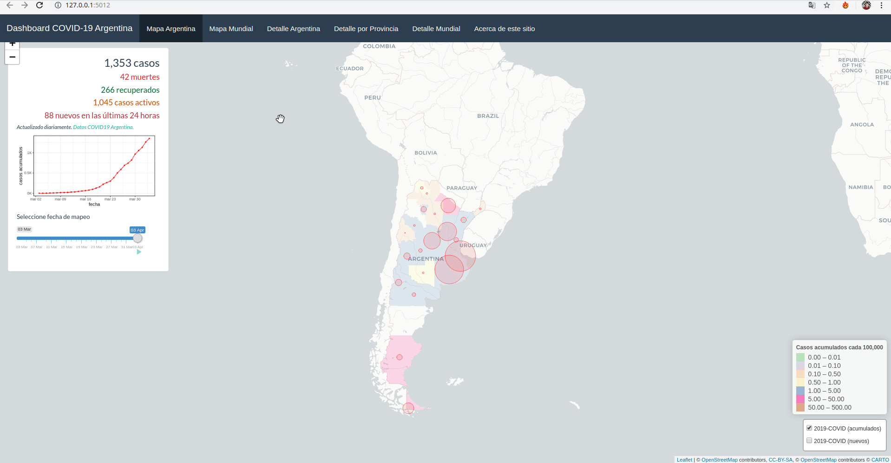

Link para acceder al [Dashboard COVID19 Argentina](https://cristianrohr.shinyapps.io/covid19_Argentina/)

## Acerca de este repositorio
Este repositorio se basa en el repositorio [eparker12/nCoV_tracker](https://github.com/eparker12/nCoV_tracker).

## Sobre el dashboard
La idea es ofrecer información para la República Argentina, la cual pueda ser analizada a modo de 'timeline', con vistas en modo mapa y con gráficos de casos a nivel de provincia, estandarizada cada 100000 habitantes. La información utilizada se encuentra en el siguiente [repo](https://github.com/cristianrohr/covid19ARgentina_stats).

Además cuenta con datos a nivel mundial, agregados por países, obtenidos de la información proporcionada por la [Universidad John Hopkins](https://hub.jhu.edu/novel-coronavirus-information/).

## Autor
**Cristian Rohr**. Msc. Ciencia de Datos Universidad de Granada y Lic. Bioinformática Universidad Nacional de Entre Ríos.

**Contacto**:

+ cristianrohr768@gmail.com
+ https://www.linkedin.com/in/cristianrohrbio

## Version Original
Dr Edward Parker, The Vaccine Centre, London School of Hygiene & Tropical Medicine
Quentin Leclerc, Department of Infectious Disease Epidemiology, London School of Hygiene & Tropical Medicine
Covid 2019 interactive mapping tool https://vac-lshtm.shinyapps.io/ncov_tracker/

**Incluye codigo adaptado de los siguientes orígenes:**
* https://github.com/rstudio/shiny-examples/blob/master/087-crandash/
* https://rviews.rstudio.com/2019/10/09/building-interactive-world-maps-in-shiny/
* https://github.com/rstudio/shiny-examples/tree/master/063-superzip-example
* https://pmoracho.github.io/blog/2017/05/11/Graficos-con-mapas-en-R/
